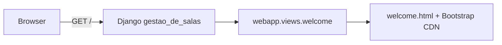

# Gestão de Salas

Sistema web em Django para gestão de salas. O projeto está em estágio inicial, com uma página de boas-vindas configurada e pronta para evolução.

## Stack tecnológica

- Python 3
- Django 5.2.5
- SQLite
- Bootstrap 5.3.8 (via CDN)

## Pré-requisitos

- Python 3.10+ instalado
- Git (opcional, para clonar o repositório)

## Instalação

### Opção A — script (Linux/macOS)

```bash
chmod +x bin/setup.sh
./bin/setup.sh
```

### Opção B — manual (Windows e demais sistemas)

```bash
python -m venv venv
venv\Scripts\activate        # Windows
# source venv/bin/activate   # Linux/macOS
pip install -r requirements.txt
python manage.py migrate
```

## Executar o servidor

```bash
python manage.py runserver
```

Acesse [http://127.0.0.1:8000/](http://127.0.0.1:8000/) para ver a página de boas-vindas.

### Admin Django (opcional)

Para acessar o painel administrativo em [http://127.0.0.1:8000/admin/](http://127.0.0.1:8000/admin/), crie um superusuário:

```bash
python manage.py createsuperuser
```

## Estrutura do projeto

```
gestao-de-salas/
├── bin/setup.sh
├── gestao_de_salas/     # configurações do projeto Django
├── webapp/              # app principal (rotas e templates)
├── manage.py
└── requirements.txt
```

## Desenvolvimento

- **App Django:** `webapp`
- **Rotas do projeto:** `gestao_de_salas/urls.py` inclui `webapp.urls`
- **Rotas da app:** `webapp/urls.py` — rota `/` aponta para a view `welcome`


